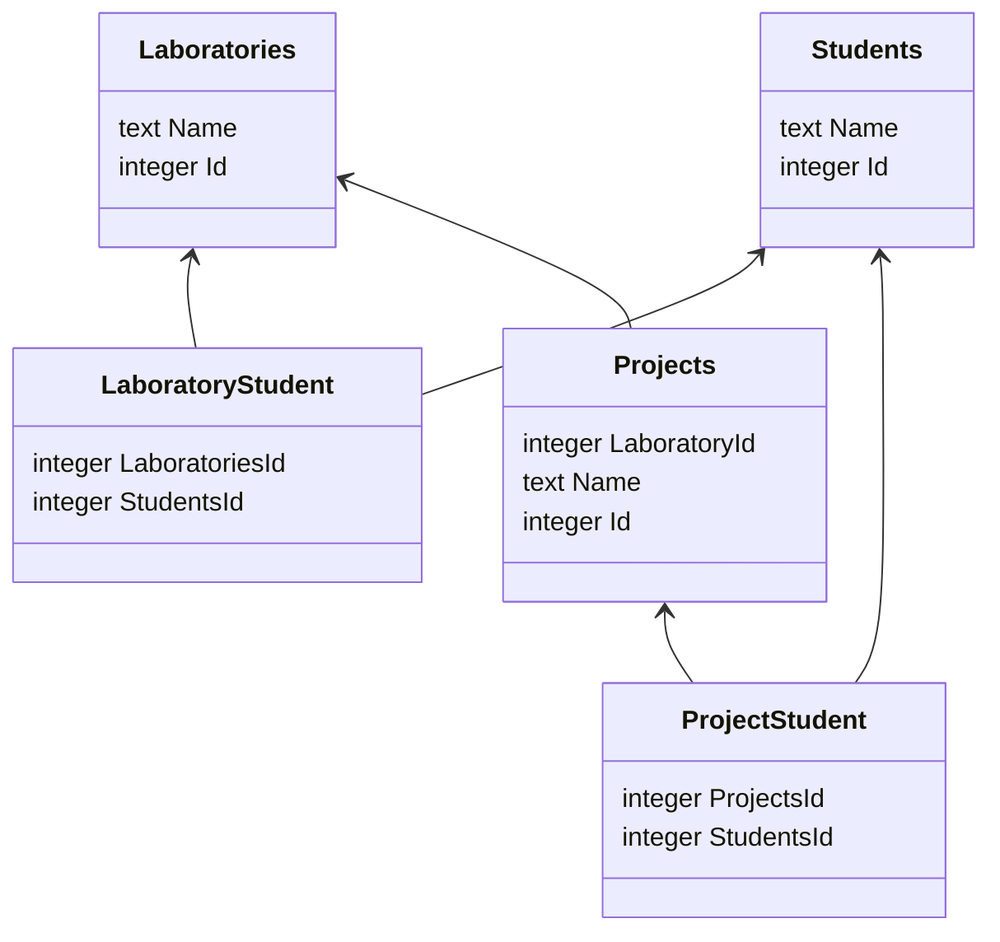

# [sample-lab-management][repo]

[](https://github.com/sombriks/sample-lab-management/actions/workflows/build.yml)

Sample dotnet rest api.

## Environment

- [Fedora 41][fedora]
- [,Net Core 8.0][dotnet]

As preferred IDE, either use [visual studio code][code] or
[jetbrains rider][rider].

## Initial setup

Install dotnet sdks on fedora:

```bash
sudo dnf install dotnet-sdk-9.0
sudo dnf install dotnet-sdk-8.0
```

Install [code generation tools][codegen]:

```bash
dotnet tool install -g dotnet-aspnet-codegenerator
dotnet tool install -g dotnet-ef
```

Add dotnet tools in the path:

```bash
echo 'export PATH=$HOME/.dotnet/tools:$PATH' >> ~/.bashrc
source ~/.bashrc
```

### How this project was scaffolded

Use [dotnet cli][cli] to scaffold a minimal web project:

```bash
dotnet new web -o sample-lab-management

cd sample-lab-management

dotnet add package Microsoft.VisualStudio.Web.CodeGeneration.Design
dotnet add package Microsoft.EntityFrameworkCore.SqlServer
dotnet add package Microsoft.EntityFrameworkCore.InMemory
dotnet add package Microsoft.EntityFrameworkCore.Sqlite
dotnet add package Microsoft.EntityFrameworkCore.Design
dotnet add package Microsoft.EntityFrameworkCore.Tools

mkdir -p App/{Controllers,Models}

touch App/Main.cs
touch App/Models/Student.cs
touch App/Models/Laboratory.cs
touch App/Models/Projectz.cs
touch App/Models/ModelsContext.cs
```

### Controller scaffolding

In order to create a controller class, use thd sample bellow:

```bash
dotnet aspnet-codegenerator controller \
 -name ProjectController -async -api \
 -m Project -dc ModelsContext \
 -outDir App/Controllers
```

### Migration scaffolding

To create database migrations:

```bash
 dotnet ef migrations add InitialSchema
```

Where `InitialSchema` is the migration name.

Those migrations are generated based on models.

## How to build

```bash
dotnet build
```

## How to run

```bash
dotnet run
```

## How to test

```bash
# under construction
```

### e2e tests

In order to easily check the endpoints, run the provided
[postman collection using newman][newman]:

```bash
# sudo npm -g install newman
newman run sample-lab-management.postman_collection.json 
```

It requires [nodejs][node] to be installed, but import collection into postman
woks as well.

There is also a [/swagger][swagger] endpoint to offer an easy way to try the
endpoints.

## Entity schema



## Endpoints

| URI                                         | Verbs            | Description                                   |
|---------------------------------------------|------------------|-----------------------------------------------|
| /status                                     | GET              | simple status check                           | 
| /api/laboratory                             | GET, POST        | list and create laboratories                  | 
| /api/student                                | GET, POST        | list and create students                      | 
| /api/project                                | GET, POST        | list and create projects                      | 
| /api/laboratory/{id}                        | GET, PUT, DELETE | find, update and remove one laboratory        | 
| /api/student/{id}                           | GET, PUT, DELETE | find, update and remove one student           | 
| /api/project/{id}                           | GET, PUT, DELETE | find, update and remove one project           | 
| /api/laboratory/{id}/student/{studentId}    | PUT, DELETE      | add and remove laboratory/student association | 
| /api/student/{id}/laboratory/{laboratoryId} | PUT, DELETE      | add and remove laboratory/student association | 
| /api/student/{id}/project/{projectId}       | PUT, DELETE      | add and remove project/student association    | 
| /api/student/{id}/project/{projectId}       | PUT, DELETE      | add and remove project/student association    | 

## Noteworthy

- By the time of this writing, controller generation fails on sdk 9.
- There is a simpler "minimal web api" besides the controller based one, but for
  the sake of the exercise we went with controller style.
- Unit and integration tests are not present. Most .NET test frameworks tested
  demand a dedicated test project, so it would demand a solution layout change.
- Entity framework does a decent job on query building. It is similar to
  [knex][knex].
- Database migrations base themselves in the current state of the models. A
  better, more flexible approach allowing sql scripts is more desirable.

## Future improvements

- Fix solution layout to comport test project.
- Proper environment variables setup. For example, database config is hardcoded.
- Switch database to Postgres. sqlite is enough for a sample, but hardly will be
  enough for production scenarios.
- Cover the code with proper unit and integration tests.
- Add the rest of the endpoints into the postman collection. Also add more test 
  scenarios beyond the _happy path_.
- Integrate the tests into CI pipeline.
- Implement docker image building and publishing in CI.

[repo]: https://github.com/sombriks/sample-lab-management

[fedora]: https://fedoraproject.org/

[dotnet]: https://dotnet.microsoft.com/en-us/download

[cli]: https://learn.microsoft.com/pt-br/dotnet/core/tools/dotnet-new#synopsis

[codegen]: https://learn.microsoft.com/en-us/aspnet/core/tutorials/first-web-api?view=aspnetcore-9.0&tabs=visual-studio-code#scaffold-a-controller

[swagger]: https://learn.microsoft.com/pt-br/aspnet/core/tutorials/getting-started-with-nswag?view=aspnetcore-8.0&tabs=net-cli#add-and-configure-swagger-middleware

[code]: https://code.visualstudio.com/

[rider]: https://www.jetbrains.com/rider/

[newman]: https://learning.postman.com/docs/collections/using-newman-cli/installing-running-newman/

[node]: https://nodejs.org

[knex]: https://knexjs.org